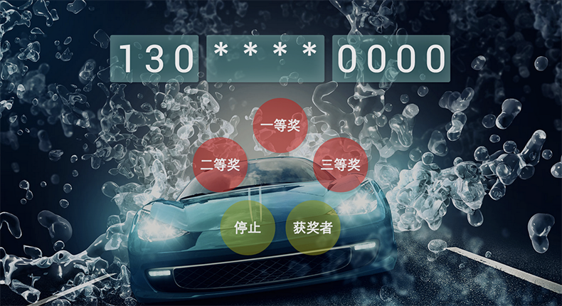

lottery
=======
#抽奖小插件
注：由于使用了window.localStorage和一些css3特效，IE下不兼容，建议用webkit游览器。


[TOC]

##1、功能
1.不重复的以手机号为基础的抽奖

2.支持按钮命令操作和键盘命令操作

3.支持但结果和多结果综合查看

4.支持清空所有获奖名单或单一一条获奖名单。




##2、Install
从html角度看这不是一个真正意义上的插件，因为它是完整的2个页面，我只是把它的js部分写成了插件形式，方便动态设置参数，而不用去研究源码。

###lottery.html抽奖页面
`<link href="/css/lottery.css" rel="stylesheet" />`
`<script type="text/javascript" src="js/jquery-2.0.3.min.js"></script>`(建议2.0以上的jquery文件)  
`<script src="/js/dataSource.js" ></script>` (如果你使用自定义的来自数据库的数据，可以不加载这个js文件)   
`<script src="/js/lottery.js" ></script>`

###lottery.result抽奖结果页面（如果需要的话）
`<script type="text/javascript" src="js/jquery-2.0.3.min.js"></script>`  
`<script type="text/javascript" src="js/dataSource.js"></script>` (如果你使用自定义的来自数据库的数据，可以不加载这个js文件,但是要保证能获取你的数据，例如在抽奖页面插件初始化时将数据存入到window.localStorage中)   
`<script type="text/javascript" src="js/lottery_res.js"></script>`

##3、API
###1.General
**awards**

指定默认抽奖类型（适用于键盘操作，不按下抽奖类型直接抽取的情况）

```
default:'third'      
options: 'first','second','third','grateful'
```

**prize**

设置奖项：`nub`-该奖项的名额限制； `prize_name` -该奖项的奖品名称；`prize_img`-该奖项的奖品图片，可为空。

注：硬性设定了一等奖、二等奖、三等奖、参与奖4中奖项类型，如有不需要的奖项如参与奖，可将该奖项的相关内容设置为空，必须设置。

```
default:
       prize:{
              'first':{ 'nub':1 ,'prize_name':'最新款mac pro一台', 'prize_img':'img/mac_pro.jpg'},
              'second':{ 'nub':2 ,'prize_name':'iphone6 一台', 'prize_img':'img/iphone6.jpeg'},
              'third':{ 'nub':3 ,'prize_name':'ipad air 一台', 'prize_img':'img/ipad.jpg'},
             'grateful':{ 'nub':0 ,'prize_name':'', 'prize_img':''},
        },
options:'nub':integer,
        'prize_name':string,
        'prize_img':url路径/''
```


**default_btn**

默认的按钮点击抽奖事件，包括按钮样式

```
default:true
options:boolean (true / false)
```

**default_result**

默认的抽奖结果蒙版显示效果，每次抽取完一个奖品即显示。

```
default:true
options:boolean (true / false)
```
**avatar**

头像滚动效果。

```
default:true
options:boolean (true / false)
```

**title**

抽奖活动标题，在进入抽奖界面之前的短暂展示（也可在html代码中直接修改）

```
default:'幸运之石砸中卿'
options:string
```
**keyevent**

键盘触发抽奖事件

```
default:true
options:boolean (true / false)
```

**<span id="customData">customData</span>**

使用外部的自定义抽奖名单数据，一般来自数据库取出的数据，与回调函数`dataLoad`一起使用。

```
default:false
options:boolean (true / false)
```

###2、Public methods

**query**

查询某号码是否中奖  
参数：tel - 手机号 
返回：boolean (true / false)，改手机号中奖即返回true

```
example:
lottery = $('#lottery').lottery();
lottery.query('18868800000');
```
**latestLucky**

获取最新的一位中奖者的信息  
参数：无 
返回：Object ，example: {tel: "136****7294", nick: "Run的微笑", url: "avatar/u=185553609,1774252923&fm=56.jpg"}

```
example:
lottery = $('#lottery').lottery();
lucky = lottery.latestLucky();
console.log(lucky.tel);
```


**result**

获取所有抽奖结果  
参数：无  
返回：json格式，具体格式取决于你的dataSource格式

```
example:
lottery = $('#lottery').lottery();
result_data = lottery.result();
```

**delete**

删除某条中奖数据  
参数：tel- 手机号码  
返回：无

```
example:
lottery = $('#lottery').lottery();
lottery.delete('18868800000');
```
**deleteLatest**

删除最近的一位中奖数据（适用于抽奖时某位中奖者未到场，故而重新抽取的情况）  
参数：无  
返回：无  

```
example:
lottery = $('#lottery').lottery();
lottery.deleteLatest();
```

**clear**

清空获奖数据  
参数：无  
返回：无 

```
example:
lottery = $('#lottery').lottery();
lottery.clear();
```

**start**

控制手机号开始滚动  
参数：无  
返回：无 

```
example:
lottery = $('#lottery').lottery();
lottery.start();
```


**stop**

控制手机号结束滚动  
参数：无  
返回：无 

```
example:
lottery = $('#lottery').lottery();
lottery.stop();
```

**default_result**

默认样式的抽奖结果显示  
参数：无  
返回：无 

```
example:
lottery = $('#lottery').lottery();
lottery.default_result();
```

###3、callback
**<span id="dataLoad">dataLoad</span>**

加载外部数据,请确保外部引入的数据与dataSource.js中json数据格式相同

```
example:
$(body).lottery({
        dataLoad: function(){
             $.get("yourUrl",function(data){
                if(data.rowCount > 0){
                            dataSource = data.data;
                            config.total = dataSource.length;
                            config.set('dataSource',JSON.stringify(dataSource));
                            config.reading();
                        }else{
                            alert('没有抽奖数据');
                        }
                },'json'); 
             }
});

注：window.localStorage.setItem( 'dataSource', dataSource );当数据源较小时可以这样存储，方便其他页面如获奖页面获取。

```

##4、默认配置的使用说明
###1、键盘事件
键盘可触发本抽奖插件的抽奖  

* 按空格开启与暂停  
* 大键盘数字键，切换奖项：  
	* 1 -- 一等奖1名:神秘西藏之旅、
	* 2 -- 二等奖2名：大美青海之旅、
	* 3 -- 三等奖3名：坝上草原之旅、
	* 4 -- 感恩奖15名：华东单日游
	* CTRL + DELETE -- 清空所有抽奖
* 其中感恩奖，为了节省按空格的次数  --  抽奖暂停时，会间隔2s抽出5个。

###2、按钮事件
默认的按钮点击后抽取相应的奖项 
 
* “一等奖”、“二等奖”、“三等奖”的按钮点击后进入相应奖项的抽奖状态,手机号及头像（如果avatar:true的话）开始滚动。
* “停止”点击后结束该次抽奖，手机号和头像停止转动，抽奖结果显现，蒙版效果显示中奖者的姓名、手机号、奖项、奖品、以及奖品图片（如果default_result: true）。
* “获奖者”按钮点击后进入到新页面-获奖结果页，显示所有获奖者名单及信息，在结果页返回按钮会返回至抽奖页，抽奖数据不会丢失，“清空”按钮可清空获奖名单。

###3、数据源
请遵从dataSource.js文件中json的数据格式，在该格式的基础上增加抽奖人员的信息

1.抽奖人员的信息存储为json文件格式，参照demo中的dataSource.js。
2.从数据库获取抽奖人员信息，请参见[`customData`](#customData)和[`dataLoad`](#dataLoad)。


附：这个抽奖页面的大部分源码来自github上的一个开源作品，感觉效果很酷，但是要改动起来得读源码很费时间，所以我在使用过程中把它封装成了一个插件，方便修改参数，原页面代码库：[https://github.com/Jschyz/lottery](https://github.com/Jschyz/lottery)
